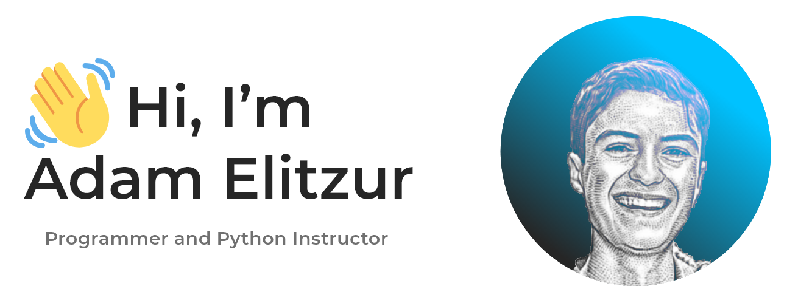

# 👋 Hi, I'm Adam Elitzur

<!-- <picture>
  <source media="(prefers-color-scheme: dark)" srcset="img/portfolio-website-header-dark.png">
  <source media="(prefers-color-scheme: light)" srcset="img/portfolio-website-header-light.png">
  
</picture> -->

I have been learning programming for over 4 years and really love it. I started with Python, and then web development, specifically HTML, CSS, and JS, where I built many projects. I then learned Java. Now I am getting into machine learning, which is a whole new world that I am very excited about. I completed three programming courses, Colt Steele's Web Development Bootcamp, Modern Python 3 Bootcamp, and CS50 (Harvard's Introduction to Computer Science), which I completed the summer before 9th grade. Studying alongside first year students at Harvard and successfully solving the same problem sets that they were all given, gave me the confidence to continue on this journey.

I joined [Buildspace's Nights & Weekends program](https://buildspace.so), where I built [Songlingo](https://song-lingo.com) in 6 weeks!

## Programmer and Python Instructor

- 🌱 I'm currently building [Songlingo](https://song-lingo.com), a website to learn languages through songs
- 🤝 I'm open to collaborating on ML, Web Development, or Python Projects

  
### Languages and Tools:

  
### Design Software

### Connect with me:

&nbsp;&nbsp;

&nbsp;&nbsp;

&nbsp;&nbsp;

### 📕 Latest blog posts:
<!-- BLOG-POST-LIST:START -->
- [Presenting my startup to Congress at the nation’s Capitol: Congressional App Challenge’s #HouseOfCode](https://blog.adamelitzur.com/presenting-my-startup-to-congress-at-the-nations-capitol-congressional-app-challenges-houseofcode)
- [6 weeks of building my dream with Buildspace Nights &amp; Weekends](https://blog.adamelitzur.com/6-weeks-of-building-my-dream-with-buildspace-nights-weekends)
- [Former South Floridian Farza Majeed raised $10M for school backed by Andreessen Horowitz; now helping others&#39; ideas come to life](https://blog.adamelitzur.com/former-south-floridian-farza-majeed-raised-10m-for-school-backed-by-andreessen-horowitz-now-helping-others-ideas-come-to-life)
- [18th Annual South Florida Devcon Brings Together Developers, Designers, Tech Professionals and Educators](https://blog.adamelitzur.com/18th-annual-south-florida-devcon-brings-together-developers-designers-tech-professionals-and-educators)
- [History &amp; Future of Tech in South Florida](https://blog.adamelitzur.com/history-future-of-tech-in-south-florida)
<!-- BLOG-POST-LIST:END -->
